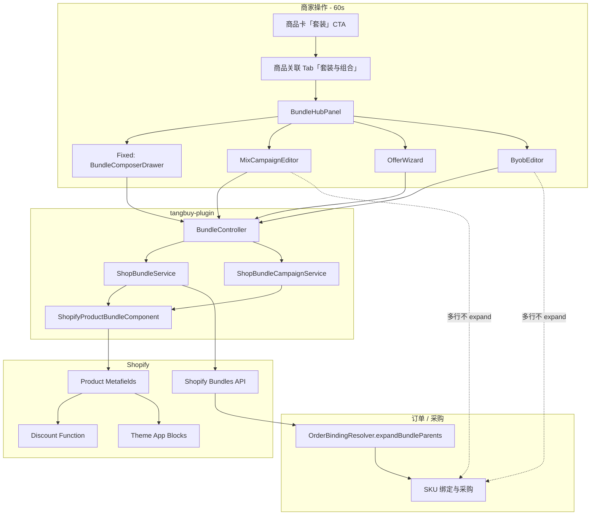

# Tangbuy / 60s Bundle 功能审计报告（专业评审用）

**日期：** 2026-08-03  
**范围：** 前端 `shopify_qianru` + 后端 `tangbuy-plugin` + Shopify Theme Block / Discount Function  
**目的：** 供熟悉 Shopify Bundle / Discount Function / 跨境采购拆单的同学评审实现完整性、机制取舍与后续建议  

---

## 1. 产品定位（一句话）

在 60s「商品关联」内提供统一的 **「套装与组合」Hub**：用「玩法」区分固定套装、任选、单品优惠、自组礼盒；规则由 App 写入 Shopify metafield / Bundle API；**采购侧只对 Fixed Kit 父行做展开**，Mix/BYOB/赠品保持多商品行按行采。

这不是独立 Shopify App，而是 AI Sourcing 子能力。

---

## 2. 玩法矩阵与成熟度

| 玩法 | 商家心智 | Shopify 实现 | 采购 | 成熟度 |
|------|----------|--------------|------|--------|
| **Fixed Kit** `fixed_kit` | 多 SKU 合成可售父商品 | `productBundleCreate/Update` + `tangbuy_bundle.*` + Theme Kit Block + Function `%` | `expandBundleParents` 按父变体拆组件行 | **生产可用（主路径）** |
| **Mix & Match** `mix_match` | 池内任选满 N 件优惠 | `shop_bundle_campaign` + 池商品 `tangbuy_mix.rule` + Function（percent **与一口价**） | 多行，不 expand | **配置+结账可用（需 deploy Function）** |
| **Product Offer** `product_offer` | 挂在单品上的件数/双规格/赠品 | `tangbuy_combo.config` / `tangbuy_gift.rule`；无 campaign 行 | 多行（赠品行由 Theme 同步） | **Combo + 赠品免单可用（需 Theme Block + Function）** |
| **BYOB** `byob` | 槽位自组礼盒 | campaign + `tangbuy_byob.rule`（含 poolProducts）+ Theme Block | 多行 | **发布 ACTIVE 后店面可选配加购** |

---

## 3. 端到端架构



### 双存储模型（评审关键）

| 存储 | 用途 |
|------|------|
| `shop_product_bundle` | Fixed Kit 执行明细（父商品、组件快照、状态机） |
| `shop_bundle_campaign` | Hub 活动头：目前**仅**写入 `mix_match` / `byob` |
| Product metafields | 结账 Function / Theme 的唯一运行时规则源 |
| Fixed 在 Hub 列表中 | FE 用 status-map **合成**展示，不写 campaign 表 |

---

## 4. 前端使用流程（商家路径）

### 4.1 入口

1. **主入口：** 商品关联 → Tab「套装与组合」→ 活动列表 →「新建活动」→ 选玩法 → 向导  
2. **快捷入口：** 商品卡 footer 单一「套装 / 编辑套装」→ 打开 Hub 并 seed 该商品（已去掉并列「赠品规则」）  
3. **Kit 父卡：** 视为套装货源（不重匹配）；可跳 Shopify Admin  

### 4.2 各玩法配置流

**Fixed Kit**

1. Hub 选「固定套装」或从已失败/已组套商品进入  
2. `BundleComposerDrawer`（Hub 内 `lockedTrack=cross`，不再先选双轨）  
3. 标题、上架价、折扣%、勾选组件与变体 → 创建/更新 Shopify 父商品  
4. 可解散；失败可重试（新建行，不 update FAILED）  

**Mix**

1. 满件数 + 计价方式（下拉：折扣% / 一口价）+ 数值  
2. 勾选可选池（仅 ACTIVE 绑定可勾；列表展示全部并标「未关联」）  
3. 保存 → 后端写 campaign + 池内 metafield  

**Product Offer**

1. 选「件数/规格组合」或「满件赠品」  
2. 复用 `SameProductComboPanel` / `GiftRuleDrawer`  
3. **不出现在 Hub 活动列表**（难回访编辑）  

**BYOB**

1. 配置槽位：名称、最少/最多、可选池  
2. 默认存 `DRAFT`；说明文案强调店面需挂 Theme Block  
3. 店面 Block：仅当前商品 id 可一键加购；池内其他商品多数只显示 ID  

### 4.3 前端关键文件

| 区域 | 路径 |
|------|------|
| Hub 壳 | `src/components/bundle-hub/bundle-hub-panel.tsx` |
| 玩法选择 | `play-type-picker.tsx` |
| Mix / BYOB / Offer | `mix-campaign-editor.tsx` / `byob-editor.tsx` / `offer-wizard.tsx` |
| Fixed 编辑器 | `src/components/select/bundle-composer-drawer.tsx` |
| Combo / Gift | `same-product-combo-panel.tsx` / `gift-rule-drawer.tsx` |
| API | `src/lib/bundle/api.ts`、`campaign-api.ts`、`campaign-types.ts` |
| 入口接线 | `src/app/[locale]/products/page.tsx`、`shop-products-panel.tsx` |

---

## 5. 后端机制与 API

**Controller：** `BundleController` `@RequestMapping("/api/plugin/bundle")`  
**鉴权：** `ShopAccessGuard.assertOwner`

### 5.1 Fixed Kit

| API | 行为要点 |
|-----|----------|
| `POST /create` | 资格校验 → ACTIVE 绑定门禁 → 落库 CREATING → `productBundleCreate` → 轮询 → enrich（图/详情/tag/`is_kit`/`components_json`/折扣 metafield） |
| `POST /update` | 仅 managed；FAILED 不可 update |
| `POST /{id}/dissolve` | 清 marker → 删父商品 → DISSOLVED |
| `GET /status-map` | 供商品卡徽标与 Hub 合成 Fixed 列表 |

**状态机：** `CREATING | ACTIVE | FAILED | STALE | DISSOLVED`  
**Webhook：** 父删 → DISSOLVED；组件/父变更 → STALE（自有写入约 180s 宽限）

### 5.2 Campaign（Mix / BYOB）

| API | 行为要点 |
|-----|----------|
| `GET /campaign/list` | 库内 mix/byob |
| `POST /campaign/mix/save` | 校验池 ≥ minQty、ACTIVE 绑定；ACTIVE 时写/清 `tangbuy_mix.rule` |
| `POST /campaign/byob/save` | 槽位池拍平；**DRAFT 也会写 metafield** |
| `POST /campaign/{id}/archive` | 清 metafield + soft delete |

**注意：** FE 已导出 `archiveCampaign` / `getCampaign`，**Hub UI 未接归档**。

### 5.3 Combo / Gift

| API | 行为 |
|-----|------|
| `POST /combo/save` | 写 `tangbuy_combo.config`；响应恒 `checkoutPending=true` |
| `POST /gift/save` | 写 `tangbuy_gift.rule`；明确 Phase 1 仅持久化 |

### 5.4 Metafield 约定

| Namespace | Key | 读者 |
|-----------|-----|------|
| `tangbuy_bundle` | `discount_percent`, `is_kit`, `components_json` | Function / Kit Theme Block |
| `tangbuy_combo` | `config` | Function |
| `tangbuy_gift` | `rule` | （尚无 Function） |
| `tangbuy_mix` | `rule` | Function（percent） |
| `tangbuy_byob` | `rule` | BYOB Theme Block |

Shopify tag：`tangbuy-kit`。

Metafield GraphQL 失败多为 **warn + skip**（库已成功、店面可能缺规则）。

---

## 6. 结账与店面

### Discount Function（`extensions/bundle-discount`）

目标：`cart.lines.discounts.generate.run`（delivery stub 空操作）

| 规则源 | 行为 |
|--------|------|
| `tangbuy_bundle.discount_percent` | 父行 % 折扣 |
| `tangbuy_combo.config` | 件数门槛或双规格齐备时 % |
| `tangbuy_mix.rule` | 同 `campaignId` 池内合计 qty ≥ minQty → **percent 或一口价 fixedAmount** |
| `tangbuy_gift.rule` | 触发品满件 → 赠品变体行 **100%**（需店面区块把赠品加进购物车） |
| byob | Theme Block 选配（仅 ACTIVE）；无折扣 |

**运维依赖：** `shopify app deploy` + Admin 创建 **Automatic App Discount** 勾选 Product class。无此步骤则 metafield 无效。

### Theme Blocks（`extensions/bundle-components-block`）

| Block | 作用 |
|-------|------|
| Kit components | 读 `is_kit` + `components_json`，展示组成与省钱文案 |
| BYOB builder | 读 `tangbuy_byob.rule`；**不强制 min/max**；非当前商品 id 无法可靠加购 |

规则**不进**主题编辑器手填池——符合「规则在 60s」原则。

---

## 7. 订单与采购逻辑（不变原则）

```text
Shopify 订单行
  → OrderBindingResolver.expandBundleParents
      仅当 outerVariantId 命中 ACTIVE shop_product_bundle.parent_variant_id
      → 拆成组件合成行（qty×、价格按件数加权分摊）
  → 逐行 SKU 绑定 / 采购

Mix / BYOB / Combo / Gift：不 expand，与普通多商品单相同
```

### 采购风险点（专业评审重点）

1. **STALE Kit 仍可能在 Shopify 售卖，但不 expand** → 父行常 UNBOUND，运营踩坑。  
2. 组件快照缺 `variantId` → 合成行无 outerVariantId → 永久 UNBOUND。  
3. 创建门禁是 **商品级 ACTIVE 绑定**；展开绑定是 **SKU 级** → 允许组套但采购仍可能挂。  
4. 价格分摊按件数加权，不等于真实货源成本结构。

---

## 8. 已实现 / 未实现清单

### 已实现（可评审为「到位」）

- [x] Hub IA：一入口多玩法；商品卡单 CTA  
- [x] Fixed Kit 全链路：创建/更新/解散/状态图/Webhook STALE  
- [x] Fixed enrich：父商品 ACTIVE、tag、composition metafield、主题展示  
- [x] Fixed 订单 expand + 采购按组件  
- [x] Mix 规则+池 CRUD、ACTIVE 绑定门禁、percent 进 Function  
- [x] Combo 配置写入 + Function 件数/双规格 %  
- [x] Gift / BYOB **配置落库 + metafield**  
- [x] Campaign 表 prod 可 `ensureSchema` 自建  
- [x] 商家文档：`BUNDLE_HUB.md`、Deploy 说明  

### 未实现或半成品（建议优先讨论）

| 项 | 现状 | 建议讨论方向 |
|----|------|----------------|
| Mix **一口价** | Function 按池小计分摊 fixedAmount | 已实现；需 redeploy Function |
| Gift **结账免单** | Function 100% + Theme「满件赠品」同步加购 | 已实现；需挂 Theme Block + redeploy |
| BYOB **店面选配** | ACTIVE + poolProducts + 槽位校验一次加购 | 已实现；需发布与挂 Block |
| Product Offer **列表回访** | Hub 列表无行 | 合成 campaign 或商品反查 |
| Campaign **启停/归档/复制** | API 有 archive，UI 无 | P3 打磨 |
| Hub 列表 **远程失败静默** | catch → 空 | 明确错误态 |
| Fixed **`shop_product_bundle` prod DDL** | 无 ensureSchema | 迁移清单 / 与 campaign 对齐 |
| STALE Kit 售卖 | 不 expand | 售卖闸门 or STALE 仍 expand + 告警 |
| 文档漂移 | DUAL_TRACK / SUBFEATURE 部分过时 | 以 HUB 为准收敛 |
| 可选池 UX | 全目录 checkbox | 搜索/分页/集合 |
| Metafield 写失败吞掉 | warn only | 事务性失败回传商家 |

---

## 9. 数据与部署注意

| 项 | 说明 |
|----|------|
| 双仓 | FE：`shopweb`（GitHub）；BE：`shop.git` / `tangbuy-plugin` |
| GitLab FE | 已刻意不含 Bundle 开发线（对齐登录优化 tip） |
| Function / Theme | 变更需 `shopify app deploy` |
| Prod `schema.sql` | `spring.sql.init.mode: never`；campaign 有 ensureSchema，Fixed 表依赖历史 DDL |
| Automatic Discount | 未开则所有 % 折扣不生效 |

---

## 10. 给评审专家的问题清单（建议反馈）

1. **Fixed vs Mix/BYOB 分叉是否合理？** 父 SKU + expand  vs 多行采购——是否符合你们在 Shopify 上的最佳实践？有无「虚拟父 SKU + 履约拆单」中间态需求？  
2. **Mix 一口价：** 应用 Order Discount、Shopify Functions fixed amount，还是一期只保留 percent？  
3. **Gift：** 用 Discount Function / Cart Transform / 第三方 Free Gift 哪个更稳？库存与采购如何记账？  
4. **BYOB：** Theme Block 是否够，还是需要 Checkout UI Extension / 独立构建器？槽位约束应在加购时还是结账时强制？  
5. **STALE Kit：** Admin 改组件后，应阻断售卖、强制重同步，还是继续 expand 并告警？  
6. **Hub 领域模型：** Fixed 是否应正式落入 `shop_bundle_campaign`（`linked_bundle_id`），统一活动生命周期？  
7. **多店/多货币：** 一口价与折扣% 在多币种店的预期？  
8. **主题安装：** Block 靠商家手加是否可接受，有无 Theme App Extension 默认启用策略？  

---

## 11. 总评（供开场）

**强项：** Fixed Kit 已形成「配置 → Shopify 原生 Bundle → 主题表达 → 订单展开采购」闭环，绑定门禁与 webhook 状态意识完整；Hub IA 正确收敛了多 CTA 碎片化。  

**短板：** Hub 四玩法「配置面」齐了，但 **结账兑现** 参差（Gift / Mix 一口价 / BYOB 店面）；**活动运营**（列表回访、归档、Offer 可见性）不足；**生产 schema / STALE 售卖** 有运维风险。  

**建议叙事：** 将 Fixed 定为 v1 主力；Mix percent + Combo 定为 v1.1（依赖 Function 部署 checklist）；Gift / BYOB / Mix flat 单独立项并写清「配置成功 ≠ 结账生效」的产品边界，避免商家误解。

---

## 附录 A — 主要代码索引

**前端**

- `src/components/bundle-hub/*`
- `src/components/select/bundle-composer-drawer.tsx`
- `src/lib/bundle/{api,campaign-api,campaign-types}.ts`
- `extensions/bundle-discount/src/cart_lines_discounts_generate_run.js`
- `extensions/bundle-components-block/blocks/{kit-components,byob-builder}.liquid`

**后端**

- `controller/bundle/BundleController.java`
- `service/bundle/ShopBundleService.java`
- `service/bundle/ShopBundleCampaignService.java`
- `service/bundle/component/ShopifyProductBundleComponent.java`
- `service/order/binding/OrderBindingResolver.java`（`expandBundleParents`）
- `repository/bundle/ShopProductBundleRepository.java`
- `repository/bundle/ShopBundleCampaignRepository.java`（`ensureSchema`）

**文档**

- `docs/BUNDLE_HUB.md`（现行产品一页纸）
- `docs/BUNDLE_DISCOUNT_DEPLOY.md`
- `docs/BUNDLE_DUAL_TRACK.md`（历史双轨，部分过时）
