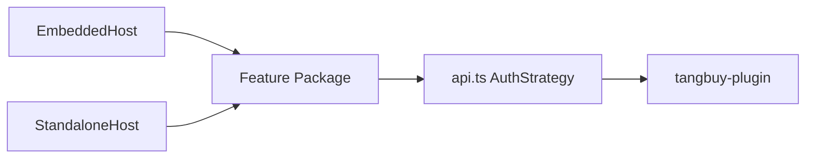

# Embedded Host Template

**唯一扩展模板**：本 App 是 **Feature-Package + Host-Shell** 双宿主。新功能只写一次业务，嵌入式与独立站通过 Host Adapter 差异化。  
后续任何模块接入 **必须** 按本文清单执行；禁止在 Feature 内散落 `if (embedded)` / 直读 `window.shopify` / 把 localStorage 当 shop 真相源。

相关文档：

- 提审 / Free / GDPR：[`SHOPIFY_APP_REVIEW.md`](./SHOPIFY_APP_REVIEW.md)
- Scope / listing：[`SHOPIFY_APP_LISTING_SCOPES.md`](./SHOPIFY_APP_LISTING_SCOPES.md)
- 环境变量：[`ENV_CONFIGURATION.md`](./ENV_CONFIGURATION.md)

---

## 1. 分层（不可破）

| 层 | 职责 | 路径 |
|----|------|------|
| **Host-Shell** | App Bridge、CSP、Admin NavMenu / TitleBar、外链跳出、session-token | `src/host/**` |
| **Host Adapters** | `navigateInApp`、`openExternal`、`AuthStrategy`、toast | `src/host/adapters/**`、`LinkInApp`、`useNavigateInApp` |
| **Feature-Package** | 业务页与组件（products / sku / logistics / sync / account…） | `src/app/[locale]/**`、`src/components/**`、`src/lib/**`（业务） |
| **Data / Auth** | 统一 `api.*`；Bearer 或 cookie；shop 从会话派生 | `src/lib/api.ts`、plugin `ShopAccessGuard` |
| **Backend** | OAuth、session-token、webhook/GDPR、持久化 | `tangbuy-plugin`（独立仓） |



**铁律：** Feature 不感知 Host。需要 Host 能力时，只调用 `@/host` 公开导出（见 `src/host/index.ts`）。

---

## 2. 新 Feature 接入清单（复制打勾）

### A. 路由与页面

- [ ] 页面放在 `src/app/[locale]/<feature>/`（或既有 feature 子路由）
- [ ] 使用 `WorkbenchShell` / 既有工作台壳；**不要**新建第二套侧栏
- [ ] 页内跳转用 `LinkInApp` / `useNavigateInApp` / `navigateInApp`，**禁止**裸 `router.push` / `<Link>` 到站内路径（会丢 `host`/`embedded`/`shop`）
- [ ] 外链（App Store、Dropshipping、文档）用 `openExternal`；Admin 深链用 `openShopifyAdminPath`
- [ ] OAuth / 装店同意页必须顶层打开（已有 `launchEmbeddedInstall` / Redirect.REMOTE）

### B. 导航注册（双 Host 同源）

- [ ] Standalone：加入工作台 step / sidebar 配置（与现有五步一致的数据源）
- [ ] Embedded：同步更新 `src/host/embedded/embedded-nav-menu.tsx` 的 `WORKBENCH_NAV`
- [ ] 两端 label 走同一 i18n key；Embedded 的 `home` 项仅一个

### C. 鉴权与 shop

- [ ] 所有读写走 `api.*`（已按 Host 附加 cookie 或 Bearer）
- [ ] **禁止**信任客户端伪造的 `shopName` 越权；plugin 侧用 `ShopAccessGuard.assertOwner`
- [ ] Embedded：shop 来自 session-token / Host；**禁止**把 localStorage 当真相源
- [ ] Standalone：保持 `tb_*` cookie + ShopSession；多店仅 standalone（`ShopSwitcher`）
- [ ] 新 plugin 接口加入 Jwt 保护前缀；需要公开的 webhook 走 HMAC，并列入 `PUBLIC_EXACT_PATHS`

### D. 数据持久化

- [ ] 用户确认类状态（接受决策、模板、绑定）必须落 **plugin DB**，禁止只写浏览器或 Next `.data/` 假装成功
- [ ] Sync / 汇总页数字必须来自真实 API；不得用 mock 灌仪表盘
- [ ] 若引入新 shop 作用域表：在 `ShopifyShopRedactService` 补 soft-delete，满足 `shop/redact`

### E. i18n

- [ ] 文案进 `src/i18n/messages/{en,zh,fr,es}.ts`（四语齐）
- [ ] 权限 / 写入能力文案与真实 scope 一致（本 App：`read_products` + `write_products`）
- [ ] **禁止**暗示本 App 处理订单、收费、积分、IAP

### F. 产品边界（本 listing 锁定）

- [ ] **Free**：不上 Shopify Billing；不恢复 bills/credits/PayPal UI
- [ ] 运营中心 / 订单中心 **不进本 App**
- [ ] Dropshipping 仅软推荐（`/upgrade`），**永不门控**本 Feature

### G. 验收（改完必做）

- [ ] `npx tsc --noEmit -p tsconfig.json`（单独跑，不并行 build）
- [ ] 有 Java 变更：`tangbuy-plugin` 下 `mvn -DskipTests compile`
- [ ] 双 Host 冒烟（见下节）

---

## 3. 禁止事项（Review / 回归红线）

| 禁止 | 原因 |
|------|------|
| Feature 内 `window.shopify` / App Bridge 直调 | 破坏 Host 边界，standalone 崩溃 |
| `localStorage` 写 shop 真相 | Embedded 串店 / 过期会话 |
| Next route 遮蔽 `/api/plugin/**` 并返回假成功 | 审核与数据欺诈风险 |
| 扩大 scope 到 orders/customers 而不改 listing | App Review 拒审 |
| 在 Admin 扩展里硬推 companion 安装 | Shopify 推广政策 |
| 嵌入式嵌套登录页 / iframe 内再开 OAuth | 白屏与嵌套登录 |

---

## 4. Host 公开 API（Feature 可依赖）

从 `@/host` 导入（不要深挖 `embedded/` 内部，除非你在改 Host 本身）：

| API | 用途 |
|-----|------|
| `useEmbeddedMode` / `useHostMode` | 只读 Host 状态（chrome 用；业务尽量不分支） |
| `LinkInApp` / `navigateInApp` / `hrefInApp` | 站内导航并保留 embedded query |
| `openExternal` / `openShopifyAdminPath` | 外链 / Admin |
| `showHostToast` | 宿主 toast（embedded 优先 Admin，否则降级） |
| `resolveAuthStrategy` | 一般无需直调；`api.ts` 已集成 |
| `exchangeSessionToken` / token store | Host bootstrap；业务勿自管 token |

---

## 5. 双 Host 验收矩阵（每个新 Feature 最小集）

| 项 | Embedded | Standalone |
|----|----------|------------|
| 入口可达功能页（带 `host` 时不丢参） | ☐ | ☐ |
| 主路径读写 API 成功（401 可恢复） | ☐ | ☐ |
| 刷新后关键状态仍在（若声称已保存） | ☐ | ☐ |
| 外链跳出不卡在 iframe | ☐ | ☐ |
| 多店：embedded 不串店；standalone 切换正常 | ☐ | ☐ |
| 无付费 / 订单误导文案 | ☐ | ☐ |

全量开店链路仍以 [`SHOPIFY_APP_REVIEW.md`](./SHOPIFY_APP_REVIEW.md) 矩阵为准。

---

## 6. 后端（plugin）扩展要点

1. Controller 在 `/api/plugin/...`；写接口鉴权 + `ShopAccessGuard`
2. 需要 Admin 推送：HMAC webhook；合规主题走 `/webhooks/compliance`
3. 装店后自动订阅：只注册本 App scope 允许的 topic（当前：products + `app/uninstalled`）
4. Session-token：`POST /api/plugin/shopify/auth/session-token`；静默开户逻辑勿在 Feature 重复实现

---

## 7. 配置触点

| 配置 | 文件 |
|------|------|
| Embedded / scopes / webhooks | `shopify.app.toml` |
| CSP `frame-ancestors` | `next.config.ts`、`src/proxy.ts` |
| API rewrite | `next.config.ts` → plugin |
| 前端 API key | `NEXT_PUBLIC_SHOPIFY_API_KEY` |

改 scope 或 webhook 后：同步 Partner Dashboard，并重新部署 plugin。

---

## 8. 一句话决策树

```
需要新能力？
  ├─ 纯业务（选品/SKU/物流…）→ Feature-Package only + 导航双注册 + plugin 持久化
  ├─ 需要 Admin chrome / 跳出 / toast → 扩 Host Adapter，再被 Feature 调用
  ├─ 需要新 Shopify 权限 → 先改 listing + toml + 本文「产品边界」评审，再动代码
  └─ 订单 / 运营 / 付费 → 不在本 App；走 Dropshipping 或独立产品
```
