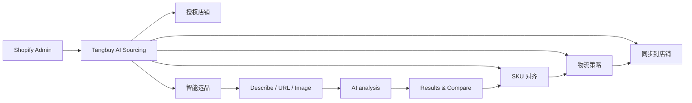

# Tangbuy AI Sourcing — Shopify App Home 视觉与交互规范

> 版本：v1.1  
> 日期：2026-07-23  
> 适用范围：Shopify Admin 内嵌 App Home（iframe）  
> 设计基线：[Shopify App Home — Polaris Web Components](https://shopify.dev/docs/api/app-home/web-components)

---

## 0. 文档用途

本规范是 Tangbuy AI Sourcing 的 UI/UX、产品与前端共同基准，用于：

- 设计 Shopify Admin 内的插件页面与完整操作流程；
- 约束视觉层级、组件选型、交互状态与文案；
- 确保插件看起来像 Shopify Admin 的原生能力，而不是嵌入的第三方网站；
- 让 AI 找货、候选商品比较、询价、导入 Shopify 等核心任务保持清晰、可预测、可访问。

### 0.1 规范优先级

发生冲突时，按以下顺序执行：

1. Shopify 官方 Polaris Web Components 的组件行为与可访问性；
2. 本文中的 Tangbuy 产品信息架构与页面规则；
3. Tangbuy 品牌表达；
4. 单个页面的临时视觉偏好。

### 0.2 官方规则与项目提案的标记

- **Shopify 基线**：来自 Shopify 官方文档，应视为强约束。
- **Tangbuy 规范**：针对本产品给出的设计决策，应作为 v1 设计基准。
- **待确认**：需要真实业务、品牌资产或技术能力进一步确认的内容。

---

## 1. 产品视觉定位

### 1.1 一句话体验

> 在 Shopify Admin 里，用一个可信、清晰、可追踪的 AI 工作流，把模糊的选品需求变成可导入店铺的商品。

### 1.2 视觉关键词

| 关键词 | 设计表现 | 避免 |
|---|---|---|
| Shopify-native | 优先使用 Polaris Web Components、标准页面结构与语义状态 | 独立 SaaS 风格的重导航、悬浮侧栏、全屏渐变背景 |
| AI-assisted | 解释 AI 正在做什么、为什么推荐、下一步是什么 | 夸张的“魔法”动画、不可解释的评分 |
| Commerce-ready | 聚焦成本、交期、MOQ、利润与导入状态 | 只展示漂亮图片，不展示商业决策信息 |
| Trustworthy | 展示来源、更新时间、置信度、风险与人工确认点 | 将估算值伪装成确定值 |
| Efficient | 主任务突出，批量操作、筛选、对比清楚 | 每个卡片堆叠大量按钮 |

### 1.3 核心设计原则

1. **一次只推动一个主要任务。** 每页最多一个主按钮。
2. **让 AI 建议可解释。** 推荐结果必须带理由、关键信号与不确定性。
3. **把风险放在决定旁边。** MOQ、利润、物流、图片版权或合规风险不能藏在二级页面。
4. **状态必须可追踪。** 从“正在搜索”到“可导入”均有明确状态、时间与下一步。
5. **先原生，后品牌。** UI 控件服从 Polaris；品牌只在标志、插画、商品媒体和语气中出现。

---

## 2. Shopify 官方视觉基线

### 2.1 组件策略

Shopify 建议 App Home 使用 Polaris Web Components，以保持与 Shopify Admin 一致的视觉、行为、可访问性和性能。核心组件分为：

- Actions：Button、Link、Menu、Button group、Clickable chip；
- Feedback：Badge、Banner、Spinner；
- Forms：Text field、Search field、Select、Choice list、Checkbox、Switch、Drop zone 等；
- Layout：Page、Section、Stack、Grid、Box、Divider、Table、Query container；
- Overlay：Modal、Popover；
- Media：Image、Thumbnail、Icon、Avatar；
- Content：Heading、Paragraph、Text、Chip、Tooltip。

### 2.2 页面容器

使用 `<s-page>` 作为页面外层容器：

| `inlineSize` | 使用场景 | Tangbuy 页面 |
|---|---|---|
| `small` | 聚焦表单或短流程 | 初始设置、连接账户、偏好设置 |
| `base` | 常规内容，可带 aside | 找货请求详情、商品详情、设置 |
| `large` | 数据密集、仪表盘、表格 | 首页、搜索结果、请求列表、导入队列 |

**Shopify 基线：**

- 页面必须有清楚描述当前内容的标题；
- 流程或详情页应提供面包屑；
- 页头操作必须作用于整个页面；
- 每页不超过 1 个主操作和 3 个次操作；
- 不在页面底部重复放置操作栏；
- `aside` 只在 `inlineSize="base"` 时使用。

### 2.3 布局与间距

Polaris 的 `padding`、`gap`、`size` 使用以 `base` 为中心的语义尺度：

`small-500 … small-100 / small → base → large / large-100 … large-500`

Tangbuy 默认规则：

- 页面级垂直间距：`base`；
- 强关联字段组：`small`；
- 页面板块间：由 `s-page` 与 `s-section` 自动控制；
- 自定义容器只在现有组件无法表达时使用 `s-box`；
- 不用空白 `<div>`、重复分割线或手工 margin 模拟层级。

### 2.4 颜色、层级与语义

颜色体系分为 **Primitive** 与 **Semantic** 两层：Primitive 保留原始色值，Semantic 供组件使用并映射为 CSS 变量。业务组件不得直接引用 Primitive；实现时优先使用 Semantic Token 或 Polaris 组件的语义属性。

#### 2.4.1 Primitive Token

| 分组 | Token | 色值 | 用途 |
|---|---|---:|---|
| Base | `base/black` | `#000000` | 基础黑色 |
| Base | `base/white` | `#FFFFFF` | 基础白色 |
| Neutral | `neutral/app-shell` | `#F3F3F4` | 应用外壳背景 |
| Neutral | `neutral/border` | `#E0E1E4` | 默认边框与分隔线 |
| Neutral | `neutral/foreground` | `#141821` | 默认正文和高强调文字 |
| Neutral | `neutral/input` | `#D2D4D8` | 输入控件边界或输入区域 |
| Neutral | `neutral/muted` | `#F1F2F4` | 弱化背景 |
| Neutral | `neutral/muted-foreground` | `#676C75` | 次要文字与弱化图标 |
| Neutral | `neutral/muted-strong` | `#E6E8EB` | 较强的弱化背景、选中承载 |
| Neutral | `neutral/page-canvas` | `#FBFBFB` | 页面画布 |
| Neutral | `neutral/ring` | `#868991` | 焦点环及中性强调边界 |
| Neutral | `neutral/secondary` | `#EDEEF1` | 次级控件背景 |
| Semantic source | `semantic/destructive` | `#E3262D` | 错误、删除与破坏性操作 |
| Semantic source | `semantic/destructive-soft` | `#FFECE9` | 破坏性信息的柔和背景 |
| Semantic source | `semantic/info` | `#0072D5` | 信息状态 |
| Semantic source | `semantic/info-soft` | `#EBF7FF` | 信息状态的柔和背景 |
| Semantic source | `semantic/success` | `#008849` | 成功状态 |
| Semantic source | `semantic/success-soft` | `#E6F7EA` | 成功状态的柔和背景 |
| Semantic source | `semantic/warning` | `#FF8000` | 警告状态 |
| Semantic source | `semantic/warning-soft` | `#FFF7E6` | 警告状态的柔和背景 |

#### 2.4.2 Semantic Token

| CSS 变量 | 映射色值 | 用途 |
|---|---:|---|
| `--app-shell` | `#F3F3F4` | 应用外壳背景 |
| `--background` | `#FBFBFB` | 默认页面背景 |
| `--border` | `#E0E1E4` | 默认边框 |
| `--brand` | `#000000` | 设计系统基础品牌色；不替代 3.2 的品牌插画色 |
| `--brand-foreground` | `#FFFFFF` | 品牌色上的前景内容 |
| `--destructive` | `#E3262D` | 错误、删除与破坏性操作 |
| `--destructive-soft` | `#FFECE9` | 破坏性信息柔和背景 |
| `--foreground` | `#141821` | 默认前景文字 |
| `--info` | `#0072D5` | 信息状态 |
| `--info-soft` | `#EBF7FF` | 信息状态柔和背景 |
| `--input` | `#D2D4D8` | 输入区域与输入边界 |
| `--muted` | `#F1F2F4` | 弱化背景 |
| `--muted-foreground` | `#676C75` | 次要文字与弱化图标 |
| `--muted-strong` | `#E6E8EB` | 较强弱化背景 |
| `--page-canvas` | `#FBFBFB` | 页面画布 |
| `--primary` | `#000000` | Polaris 基础主操作语义；Tangbuy 按钮外观以 3.2.2 为准 |
| `--primary-foreground` | `#FFFFFF` | 主操作上的前景内容 |
| `--ring` | `#868991` | 焦点环 |
| `--secondary` | `#EDEEF1` | 次级控件背景 |
| `--success` | `#008849` | 成功状态 |
| `--success-soft` | `#E6F7EA` | 成功状态柔和背景 |
| `--surface` | `#FFFFFF` | 默认内容表面 |
| `--surface-border` | `#E0E1E4` | 内容表面边框 |
| `--surface-hover` | `#F1F2F4` | 内容表面悬停态 |
| `--surface-raised` | `#FFFFFF` | 抬升表面 |
| `--surface-selected` | `#E6E8EB` | 内容表面选中态 |
| `--warning` | `#FF8000` | 警告状态 |
| `--warning-soft` | `#FFF7E6` | 警告状态柔和背景 |

#### 2.4.3 使用规则

核心 UI 通过组件的语义属性控制：

| 语义 | Polaris 用法 | Tangbuy 示例 |
|---|---|---|
| Primary | `variant="primary"` | Start sourcing、Import products |
| Secondary | `variant="secondary"` 或默认 | Save draft、Preview |
| Critical | `tone="critical"` | Delete request、Remove all |
| Success | `tone="success"` | Quote ready、Imported |
| Info | `tone="info"` | AI 分析说明、数据更新时间 |
| Subdued | `color="subdued"` 或对应背景属性 | 次要说明、辅助元数据 |

规则：

- Primitive 只作为 Semantic Token 的色值来源，不允许在业务组件 CSS 中直接使用；
- 状态色必须按语义使用：`success`、`info`、`warning`、`destructive` 不得互相替代，也不得由品牌插画色代替；
- `*-soft` 只用于对应状态的低强调背景，必须搭配同语义的文字、图标或状态文案；
- 页面画布使用 `--page-canvas`，应用外壳使用 `--app-shell`，内容卡片优先使用 `--surface`；
- Tangbuy Primary Button、Secondary Button 与 Text Button / Link 的专用外观以 3.2.2 为准；其 hover、pressed、disabled 与 focus 行为仍交由 Polaris 管理；输入框聚焦边框按 2.4.4 执行；
- 除 2.4.4 明确定义的输入框聚焦边框、可选卡片 hover 投影与 selected 描边外，禁止用自定义 CSS 重绘 Polaris 按钮、表单、Badge、Banner、Modal，或改变其内部圆角和焦点行为。

#### 2.4.4 聚焦与选中状态

**输入框聚焦：**

- 输入框获得焦点时，边框颜色统一由默认 `--input` 切换为 `#333333`；
- 该规则适用于 Tangbuy 插件自定义内容区的 Input、Search Field、Text Area、Select 等输入型控件；
- 只改变输入边框色，不改变输入框背景、文字色、圆角或控件高度；
- 键盘操作产生的 `focus-visible` 焦点环仍保留 Shopify / Polaris 的可访问性行为，不得仅用边框颜色表达焦点；
- 错误状态优先级高于普通聚焦态：校验错误时继续使用 `--destructive`，不得被 `#333333` 覆盖。

推荐实现：

```css
.input:focus,
.input:focus-visible {
  border-color: #333333;
}

.input[aria-invalid="true"] {
  border-color: var(--destructive);
}
```

**可选卡片 Hover 与 Selected：**

| 属性 | 数值 |
|---|---:|
| X Offset | `4px` |
| Y Offset | `4px` |
| Blur | `12px` |
| Spread | `0` |
| Color | `#000000`，透明度 `8%` |

- 卡片进入 hover 状态时，在原有表面与边框基础上新增该投影；
- hover 投影统一写为 `4px 4px 12px 0 rgba(0, 0, 0, 0.08)`，不得自行修改方向、模糊值或透明度；
- 卡片进入 selected 状态时使用 `1px solid #333333` 描边，不使用 hover 投影表达选中；
- selected 描边不能成为唯一的选中表达，必须同时保留选择控件、勾选标记、`aria-selected="true"` 或清晰的选中文字状态；
- 该规则仅适用于 Tangbuy 自定义内容区内可被用户选择的卡片，不适用于普通信息卡、Shopify 宿主菜单或后台导航项。

推荐实现：

```css
.selectable-card:hover {
  box-shadow: 4px 4px 12px 0 rgba(0, 0, 0, 0.08);
}

.selectable-card[aria-selected="true"] {
  border: 1px solid #333333;
  box-shadow: none;
}
```

### 2.5 响应式

- 使用 `s-query-container` 与容器查询，不依赖固定设备宽度；
- 默认采用 mobile-first fallback；
- `s-table` 保持 `variant="auto"`，宽屏显示表格，窄屏自动转列表；
- 低宽度时双栏变单栏、按钮组可换行、次要元数据折叠；
- 主操作仍应在首屏可见，不使用横向滚动承载核心任务。

### 2.6 可访问性

Polaris Web Components 自带语义 HTML、键盘操作、ARIA、焦点管理和颜色对比，但产品实现仍需：

- 每个表单组件都设置可理解的 `label`，校验失败时设置 `error`；
- 仅视觉隐藏标签时使用 `labelAccessibilityVisibility="exclusive"`；
- Heading 层级连续，不用加粗正文代替标题；
- 图标按钮必须有可访问名称或 Tooltip；
- 颜色不得成为状态的唯一表达，必须配合 Badge 文本；
- Modal 打开后焦点进入，关闭后回到触发按钮；
- 所有流程仅用键盘可完成；
- AI 加载状态需要可读文本，不只显示 Spinner。

---

## 3. Tangbuy 品牌层

### 3.1 品牌角色

Tangbuy 的品牌应表现为“聪明、可靠的采购助手”，不是抢占 Shopify Admin 的第二套设计系统。

### 3.2 品牌插画与操作色

以下 Token 是 Tangbuy AI Sourcing 当前有效的品牌插画与操作颜色；Shopify Admin 的宿主界面和系统状态仍使用 Shopify / Polaris 自身的 Semantic Token。

#### 3.2.1 品牌插画色

| Token | 色值 | 使用 |
|---|---:|---|
| Sourcing Mint | `#325BE6` | 供应链节点、正向插画元素、需要品牌识别的线性图形 |
| Soft Violet | `#EEF2FF` | 插画背景块、线性图标的非交互衬底；不得作为按钮、Tab、选中态或其他交互控件底色 |
| Ink | `#0A1E4A` | 品牌插画中的深色线条、轮廓和结构线 |

使用规则：

- Sourcing Mint 只承担供应链和正向品牌表达，不代替 `success`、`info`、`warning` 或 `critical`；
- Soft Violet 仅用于非交互视觉承载，不能暗示可点击、选中或激活；
- Ink 只用于品牌插画深色线条，不替代界面正文色；
- 不从以上颜色自行生成渐变、透明叠色或额外色阶；新增色阶必须先进入规范。

#### 3.2.2 按钮与链接色

| 类型 | 背景 / 文字 | 边框 | 使用 |
|---|---|---|---|
| Primary Button | 背景 `#333333`，文字 `#FFFFFF` | 与背景一致 | 页面唯一主要操作 |
| Secondary Button | 背景 `#FFFFFF`，文字 `#333333` | `1px solid #333333` | 与主要按钮并列的次要操作 |
| Text Button / Link | 文字 `#3A40FF`，无底色 | 无边框 | 低强调操作、页面内链接和“了解更多” |

按钮与链接规则：

- `#33333` 不是有效六位十六进制色值，本规范统一按 `#333333` 执行；
- 同一操作组内最多一个 Primary Button；Secondary Button 不得通过填充色与 Primary Button 竞争；
- Text Button / Link 不添加 Soft Violet 底色，不伪装成 Badge 或选中态；
- hover、pressed、disabled 和 focus 状态遵循 Shopify / Polaris 的组件行为，不自行推导新的品牌色。

### 3.3 Logo 与图像

**Shopify Admin 应用标题 Logo：**


- Shopify Admin 的应用标题与一级菜单统一调用 [`./assets/logo-124.svg`](./assets/logo-124.svg)；
- 标题格式为方形 Logo + 产品名称 `Tangbuy AI Sourcing`；
- 应用标题栏建议显示为 `24 × 24px`，Shopify 宿主应用菜单中建议显示为 `18–20px`；
- 必须保持 SVG 原始 `viewBox="0 0 124 124"` 的 `1:1` 比例，不得裁切或拉伸；
- Logo 与产品名称属于同一标题组，不将产品名称绘制进 SVG。

**完整品牌 Logo：**


- 完整品牌 Logo 继续调用 [`./assets/logo-svg.svg`](./assets/logo-svg.svg)，用于 onboarding、空状态、帮助说明和其他品牌展示位置；
- Logo 缩放时必须保持 SVG 原始 `viewBox="0 0 378 104"` 的宽高比例，不得拉伸、压缩或裁切；
- 完整品牌 Logo 展示时最大高度不得超过 `48px`，宽度必须自动计算；
- 不得同时指定固定宽度和固定高度；窄屏下可继续等比例缩小。

完整品牌 Logo 推荐样式：

```css
.navigation-logo {
  display: block;
  width: auto;
  height: auto;
  max-width: 100%;
  max-height: 48px;
}
```

- App 图标固定使用已确认的 `logo-124.svg`，不得另行绘制或替换；
- 保持 1:1 安全区，缩小到 32 px 仍能辨识；
- 商品图统一方形或接近方形缩略图，不裁掉主体；
- 图片缺失时显示标准占位状态，不用随意渐变；
- AI 生成内容必须标记为 AI-generated 或 AI-enhanced；
- 不用国旗作为供应商质量、信任度或价格的替代指标。

### 3.4 字体

- UI 文字继承 Shopify Admin / Polaris；
- 不加载品牌展示字体作为界面正文；
- 数字与单位保持紧密，例如 `$12.40`、`MOQ 100`、`7–12 days`；
- 长数字按商家 Locale 格式化。

### 3.5 图标

本节仅约束 Shopify Admin 内的**插件自定义内容区**。Shopify 顶部栏、后台菜单等宿主界面由 Shopify 自身负责，不由插件替换其图标。

#### 3.5.1 图标库与实现

- 插件自定义内容区必须统一使用 Shopify Polaris 自有图标库 **Polaris Icons**；
- 图标浏览：[`Polaris Icons`](https://polaris-icons.shopify.com/)；
- npm 包：[`@shopify/polaris-icons`](https://www.npmjs.com/package/@shopify/polaris-icons)；
- UI 设计系统统一为 **Shopify Polaris**；
- 禁止混用 Lucide、Heroicons、Font Awesome、Iconfont、Emoji 或其他图标库；
- 禁止为了常规界面操作自制 SVG 图标；品牌 Logo、商品图片、供应商图片等品牌或内容资产不属于功能图标，不受此条限制；
- 必须从 `@shopify/polaris-icons` 按需导入具体图标，不导入完整图标集合；
- 图标只强化已有文字，不取代关键文案；同一动作在所有页面中始终使用同一个图标；
- AI / Magic 类图标仅表示 AI 建议、AI 生成或 AI 增强，不用于普通搜索；普通搜索使用 Polaris Icons 中对应的 Search 图标。

推荐实现：

```tsx
import {SearchIcon} from '@shopify/polaris-icons';

// 通过当前项目采用的 Shopify Polaris 组件渲染 source，
// 颜色默认继承组件文字色，尺寸遵循下方规范。
```

#### 3.5.2 颜色与尺寸

| 使用场景 | Tailwind 尺寸 | 等效尺寸 | 规则 |
|---|---:|---:|---|
| 常规按钮、输入框、列表项、卡片标题 | `size-4` | `16 × 16px` | 默认规格 |
| 紧凑操作、密集表格、辅助文字 | `size-3.5` | `14 × 14px` | 仅在空间受限时使用 |
| Badge、Chip、微型状态标签 | `size-3` | `12 × 12px` | 与标签文字垂直居中 |
| 空状态主图标 | 最大 `size-8` | 最大 `32 × 32px` | 不得继续放大为装饰插画 |

- 所有功能图标默认使用 `currentColor`，继承其所在文字或组件的颜色；只有下方定义的品牌说明型图标允许使用指定颜色和背景；
- 不为普通图标单独指定渐变、阴影或规范外的彩色底板；
- 状态图标可继承对应 Semantic Token，但不得用 Sourcing Mint 冒充成功、警告或错误状态；
- 图标与文字并排时使用一致的对齐和间距，建议 `gap-1.5` 或 `gap-2`；
- 纯装饰图标必须设置 `aria-hidden="true"`；只有图标、没有可见文字的按钮必须提供可理解的 `aria-label`。

#### 3.5.3 线性图标颜色

| 图标类型 | 图标色 | 背景色 | 使用 |
|---|---:|---:|---|
| 线性有背景图标 | `#325BE6` | `#EEF2FF` | 普通说明、供应链节点或强化装饰表达；背景不可点击 |
| 线性无背景图标（弱化） | `#666666` | 透明 | 输入框、辅助功能和低强调表达 |
| 线性无背景图标（品牌强调） | `#325BE6` | 透明 | 需要突出供应链或正向品牌含义的非状态图标 |

规则：

- 有背景图标的 `#EEF2FF` 仅是图形衬底，不得添加 hover、pressed 或 selected 状态；
- 输入框内部图标优先使用 `#666666`，除非它明确表达供应链品牌含义；
- 成功、警告、错误和信息状态仍使用对应 Semantic Token，不使用 `#325BE6` 冒充状态色；
- 线性图标继续使用 `@shopify/polaris-icons`，不得为了获得指定颜色而自制 SVG。

#### 3.5.4 数字与步骤状态

| 状态 | 文字色 | 背景色 | 边框 | 使用 |
|---|---:|---:|---:|---|
| 普通说明数字 | `#325BE6` | `#EEF2FF` | 无 | 仅用于说明展示，没有明确点击行为 |
| 已完成 / 当前步骤 | `#FFFFFF` | `#325BE6` | 无 | 表示已经完成或当前正在处理的步骤 |
| 未完成 / 非当前步骤 | `#325BE6` | `#EEF2FF` | `1px solid #999999` | 表示尚未完成且当前未处理的步骤 |

步骤规则：

- 数字必须在圆形容器中水平、垂直居中；同一流程中的圆形尺寸保持一致；
- 当前步骤除颜色外还必须配合文字状态，例如“进行中”，不能只依赖颜色；
- 未完成步骤不得使用实心 `#325BE6`，避免与当前或已完成状态混淆；
- 说明数字没有点击行为时，不添加手型光标、hover 或 focus 样式；
- 步骤连接线使用中性边框色，不使用 Sourcing Mint 制造虚假的完成进度。

---

## 4. 信息架构



### 4.1 主导航

| 层级 | 导航项 | 目的 | 页面标题下说明 |
|---|---|---|---|
| 一级 | Tangbuy AI Sourcing | Shopify Admin 中的应用入口 | 不在 iframe 内重复制作全高导航 |
| 二级 | 授权店铺 | 连接 Shopify 店铺 | 连接 Shopify 店铺并同步基础数据 · 进行中 |
| 二级 | 智能选品 | 发起 AI 找货并浏览候选 | 描述产品、粘贴链接或上传图片 |
| 二级 | SKU 对齐 | 核对商品与规格映射 | 核对 Shopify 变体与供应链 SKU |
| 二级 | 物流策略 | 选择物流与履约规则 | 识别物流类型并配置策略模板 |
| 二级 | 同步到店铺 | 审核并写入 Shopify | 写入商品映射与履约配置 |

#### 4.1.1 菜单栏强制规则

- 正式上线版本必须使用 Shopify Admin / App Bridge 提供的原生导航能力；菜单栏的视觉位置、尺寸、展开方式、选中态和交互均由 Shopify 定义；
- Shopify Admin 的全局菜单、销售渠道、应用分组和账户入口均属于 Shopify 宿主界面，插件不得复制、覆盖、重绘或修改；
- 插件仅向 Shopify 提供导航信息：应用名称固定为 `Tangbuy AI Sourcing`，应用图标使用 `logo-124.svg`；
- 产品功能作为 `Tangbuy AI Sourcing` 下的子级导航信息提供给 Shopify；当前基准菜单为：`授权店铺`、`智能选品`、`SKU 对齐`、`物流策略`、`同步到店铺`；
- 子级菜单只提供简短功能名称，不提供说明、状态、步骤编号、完成百分比、帮助文字或多行副标题；
- 当前页面的菜单选中状态、键盘操作和无障碍属性由 Shopify 原生导航负责，插件不得用品牌渐变、大面积高亮或自定义彩色块重绘；
- 菜单顺序与核心工作流保持一致；新增菜单必须是稳定、可直接访问的产品功能，不把临时任务、提示或筛选器提升为导航项；
- 插件自定义内容区内禁止再次复制 Shopify 宿主菜单；自定义内容本身无需因为菜单栏调整而重新设计；
- 独立 HTML 视觉原型可以模拟 Shopify 外壳用于评审，但模拟菜单不是正式插件交付的自定义组件。

### 4.2 Shopify Admin 嵌入布局

#### 4.2.1 宿主与插件边界

- Shopify 顶部栏、全局搜索、账户入口和后台菜单栏由 Shopify 承载，正式应用不得重复实现；
- 不以固定“左侧 / 右侧”判断组件归属：无论 Shopify 在不同版本、语言方向或视口中把菜单显示在哪一侧，该菜单始终属于 Shopify 宿主区；
- Shopify 为应用提供的页面容器内部属于 Tangbuy AI Sourcing 自定义内容区；这部分内容可按产品需求设计，不因宿主菜单栏的调整而被强制改版；
- 插件自定义内容不得覆盖、挤压或悬浮到 Shopify 宿主菜单和顶部栏之上；
- 自定义内容可使用 Page、Section、Grid、Table、Card 和 aside，并遵循 Shopify Admin / App Home 的容器、留白和滚动规则，但不建立第二套全屏后台外壳。

| 区域 | 所有者 | Tangbuy 可做的事情 | Tangbuy 禁止的事情 |
|---|---|---|---|
| Shopify 宿主菜单栏与顶部栏 | Shopify | 提供应用名称、图标和子级导航配置 | 修改布局、位置、样式、选中态或交互 |
| 插件自定义内容区 | Tangbuy AI Sourcing | 按产品需求设计页面内容、卡片、表单、表格和操作 | 复制或覆盖 Shopify 宿主菜单 |

#### 4.2.2 应用头部标题栏

应用头部所在容器及其基础交互属于 Shopify 宿主规则；Tangbuy 只提供品牌资产、名称和允许的操作配置，不自行重绘宿主标题栏。

| 元素 | 约束 |
|---|---|
| 应用 Logo | 使用 `logo-124.svg`；保持 `1:1`；建议 `24 × 24px`；不得裁切、拉伸或替换为旧横版 Logo |
| 应用名称 | Logo 后固定显示 `Tangbuy AI Sourcing`；名称与 Logo 组成一个标题组 |
| 排列 | Logo 在左、名称在右，垂直居中；建议间距 `8px` |
| 高度 | 遵循 Shopify 原生应用标题区域；不得为了品牌展示建立超过正常导航高度的大型 Header |
| 操作 | 如需更多操作，置于标题栏右侧并使用 Shopify 允许的操作模式；标题组内不放页面状态和说明 |

#### 4.2.3 页面标题与说明

- 每个二级菜单页面必须在自定义内容区顶部显示唯一的页面主标题，例如 `授权店铺`；
- 原菜单中的说明文案必须移到页面主标题下方，例如 `连接 Shopify 店铺并同步基础数据`；
- 说明文案保持一至两行，解释当前页面目的或下一步，不重复菜单名称；
- `进行中`、`已完成`、`需要处理` 等状态使用 Badge 紧邻主标题显示，不写入 Shopify 宿主菜单，不与说明文案拼成一行纯文本；
- 标题、状态 Badge、说明的阅读顺序必须为：`页面标题 → 状态 → 说明文案`；
- 页面级主要操作放在标题区域的操作位或首个主要 Section 中；不得放入 Shopify 宿主菜单；
- 标题栏中的应用名称用于识别产品，页面主标题用于识别当前功能，两者不得互相替代。

#### 4.2.4 Logo 使用位置

- `logo-124.svg` 专用于 Shopify Admin 应用入口、应用标题栏及其他需要方形 App Icon 的位置；
- 旧版 `logo-svg.svg` 必须保留，可用于 onboarding、帮助卡片、空状态和品牌说明等非导航位置；
- 旧版横向 Logo 不得用于 Shopify 宿主应用菜单和应用标题栏；在其他品牌位置使用时最大高度仍不得超过 `48px`，并保持原始比例。

---

## 5. 关键用户流程

### 5.1 主流程

`输入需求 → AI 理解 → 浏览候选 → 对比/收藏 → 询价或加入导入队列 → 审核商品字段 → 导入 Shopify`

### 5.2 三种找货入口

| 入口 | 适用情况 | 主要组件 |
|---|---|---|
| Describe product | 有想法、没有链接 | Text area、Choice list、Money field |
| Paste product URL | 已有竞品或供应商链接 | URL field、Button |
| Upload image | 只有产品图片 | Drop zone、Image、Button |

三种入口使用 Choice list 或清晰分段，不做三个同等重量的大型彩色卡片。

### 5.3 决策节点

- **Quick import**：数据完整、风险低，可直接加入导入队列；
- **Request quote**：价格、MOQ、定制、物流或合规需确认；
- **Save**：暂时收藏，不改变 Shopify 商品；
- **Reject / remove**：需二次确认，但不使用 Critical 语气，除非不可恢复。

---

## 6. 核心页面视觉规范

### 6.1 Home / Dashboard

**页面容器：** `s-page inlineSize="large"`  
**标题：** `Tangbuy AI Sourcing`  
**主操作：** `Start sourcing`  
**次操作：** `View requests`

```text
┌─────────────────────────────────────────────────────────────────────┐
│ Tangbuy AI Sourcing                         [View requests] [Start] │
├─────────────────────────────────────────────────────────────────────┤
│ [Banner: 2 quotes need your review]                         [View]  │
├──────────────────┬──────────────────┬───────────────────────────────┤
│ Active requests  │ Ready to import  │ Imported this month           │
│ 6                │ 12               │ 48                            │
├─────────────────────────────────────┬───────────────────────────────┤
│ Continue where you left off         │ Quick start                   │
│ Request / status / updated / action │ Describe · URL · Image        │
├─────────────────────────────────────┴───────────────────────────────┤
│ Recent activity                                                     │
└─────────────────────────────────────────────────────────────────────┘
```

规则：

- 顶部最多一个 Banner，只展示当前最重要且可处理的信息；
- 指标卡只显示可行动指标，不展示装饰性增长百分比；
- “Continue where you left off” 优先于活动日志；
- 首次使用时以 onboarding checklist 替代指标区；
- 统计卡使用 `s-grid + s-box`，不做彩色渐变大卡片。

### 6.2 AI Sourcing / 新建找货

**页面容器：** `s-page inlineSize="base"`  
**标题：** `Find a product`  
**主操作：** `Find matches`  
**aside：** What happens next / 数据使用说明

```text
┌───────────────────────────────────────────────┬─────────────────────┐
│ Find a product                                │ What happens next   │
│ Tell us what you want to source               │ 1. AI analyzes      │
│                                               │ 2. We find matches  │
│ (●) Describe  ( ) Product URL  ( ) Image      │ 3. You review       │
│                                               │                     │
│ Product description                           │ Your inputs are ... │
│ [___________________________________________] │                     │
│ [___________________________________________] │                     │
│                                               │                     │
│ Target price   Destination   Target quantity  │                     │
│ [___________]  [__________]  [_____________] │                     │
│                                               │                     │
│ [Advanced preferences ▾]                      │                     │
│                                               │                     │
│                                  [Find matches]│                    │
└───────────────────────────────────────────────┴─────────────────────┘
```

规则：

- 主输入 label 必须具体，例如 `Describe the product you want to source`；
- 使用示例作为帮助文本，不用示例代替 label；
- Advanced preferences 默认收起，包含材质、定制、认证、交期；
- `Find matches` 在必填信息完整前 disabled；
- URL 与图片校验在字段附近显示，不用页面顶层 Banner 替代字段错误。

### 6.3 AI 分析中

**建议使用：** 页面内进度区，而非阻塞式 Modal。

```text
Analyzing your sourcing request…
[Spinner] Understanding product attributes
          Searching candidate suppliers
          Estimating landed cost

This usually takes under a minute. You can leave this page safely.
[Cancel search]
```

规则：

- 文本描述真实阶段，不展示虚假精确百分比；
- 超过预期时说明“仍在处理”并提供离开页面的安全提示；
- Cancel 为次要动作，取消后保留输入草稿；
- 如果后台继续运行，明确告知用户可安全离开。

### 6.4 搜索结果

**页面容器：** `s-page inlineSize="large"`  
**标题：** `Matches for “...”`  
**主操作：** 仅选中项目后显示 `Add to import queue`  
**次操作：** `Edit search`、`Compare`

```text
┌─────────────────────────────────────────────────────────────────────┐
│ Matches for “portable blender”       [Edit search] [Add to queue]  │
├─────────────────────────────────────────────────────────────────────┤
│ [Search within results] [Supplier ▾] [Price ▾] [More filters]      │
│ 36 matches · Updated 2 min ago                                     │
├───┬────────┬────────────────────────┬────────┬──────┬───────┬──────┤
│ □ │ Image  │ Product                │ Cost   │ MOQ  │ Lead  │ Fit  │
├───┼────────┼────────────────────────┼────────┼──────┼───────┼──────┤
│ □ │ [img]  │ Portable blender 350ml│ $8.20  │ 100  │ 9–12d │ High │
│   │        │ Why it matches: ...   │ est.   │      │       │      │
├───┼────────┼────────────────────────┼────────┼──────┼───────┼──────┤
│ □ │ [img]  │ ...                    │ ...    │ ...  │ ...   │ ...  │
└───┴────────┴────────────────────────┴────────┴──────┴───────┴──────┘
```

结果必须展示：

- 商品图片与标题；
- 供应商或来源类型；
- 商品成本与币种；
- MOQ；
- 预计交期；
- AI match level + 一句理由；
- 数据更新时间；
- 估算/待确认标记。

规则：

- 数据密集时用 `s-table variant="auto"`，不是无限卡片瀑布流；
- 筛选器放入 `filters` slot；
- 表格行的首要点击进入详情，批量选择使用 Checkbox；
- Fit 只使用 High / Medium / Low，加 Tooltip 解释判断依据；
- 成本若未包含物流或税费，必须显示 `Product cost` 或 `Estimated landed cost`，不可只写 `Cost`；
- 无结果时保留原始条件，提供 `Edit search` 与 2–3 条具体建议。

### 6.5 Compare / 商品对比

**组件：** Modal（2–4 个候选）或独立 Page（更多数据）。

| 比较维度 | 优先级 | 表达方式 |
|---|---:|---|
| Product cost | 高 | 金额 + 币种 + estimated 标识 |
| Estimated landed cost | 高 | 金额范围 + 目的地 |
| MOQ | 高 | 数字 + 单位 |
| Lead time | 高 | 天数范围 |
| Supplier confidence | 高 | Badge + 解释 |
| Customization | 中 | Yes / Limited / No |
| Certifications | 中 | 已验证 / 卖家声明 / 未知 |
| AI fit | 中 | High / Medium / Low + reason |

不要用整列绿色表示“赢家”。改为在关键差异处显示 `Best price`、`Fastest` 等中性 Chip，并让用户自己决定。

### 6.6 Product detail / 候选详情

**页面容器：** `s-page inlineSize="base"`  
**面包屑：** Results → Product  
**主操作：** `Add to import queue`  
**次操作：** `Request quote`、`Save`

内容顺序：

1. 商品媒体、标题、来源与状态；
2. AI match summary；
3. 成本、MOQ、交期、目的地；
4. 规格与变体；
5. 供应商信息与置信度；
6. 物流估算；
7. 风险与待确认项；
8. 原始来源与数据更新时间。

aside 用于 Decision summary，不放长说明。任何 Estimated 值都必须在数值附近标识，而不是只在页底统一免责声明。

### 6.7 Sourcing requests

**页面容器：** `s-page inlineSize="large"`  
**主操作：** `New request`

| 列 | 内容 |
|---|---|
| Request | 名称 + 缩略图 |
| Status | Badge |
| Quantity | 数量与单位 |
| Target price | 金额与币种 |
| Latest update | 事件摘要 |
| Updated | 相对时间 + Tooltip 中绝对时间 |

状态建议：

`Draft → Searching → Matches ready → Quote requested → Quote ready → Approved → Added to import queue → Closed`

异常状态：`Needs information`、`Search failed`、`Quote expired`。

### 6.8 Import queue

**页面容器：** `s-page inlineSize="large"`  
**主操作：** `Import selected`  
**次操作：** `Edit fields`

每一行至少展示：

- 商品图、Shopify 标题草稿；
- 变体数量；
- 售价与预计利润率；
- Product status（Draft / Active）；
- 媒体、描述、分类、库存的完整性；
- 校验状态。

导入前使用确认 Modal 汇总：商品数、变体数、目标状态和不可逆影响。默认导入为 Draft，除非商家明确选择 Active。

### 6.9 Settings

**页面容器：** `s-page inlineSize="small"` 或 `base`  
**主操作：** `Save`

分区：

- General：默认市场、币种、单位；
- Sourcing preferences：目标毛利、MOQ 上限、交期上限；
- Import defaults：标题、描述、价格、状态规则；
- Notifications：报价、异常、完成提醒；
- Connections：供应商或服务连接；
- Data & privacy：数据保存、导出与删除。

保存按钮只在表单 dirty 时启用；成功后用非阻塞反馈，不保留永久 Success Banner。

---

## 7. 组件映射

| 业务对象 / 操作 | Polaris 组件 | 使用规则 |
|---|---|---|
| 页面壳 | `s-page` | 每个路由一个明确 heading |
| 内容板块 | `s-section` | 按主题分组，不模拟卡片墙 |
| 垂直/水平排列 | `s-stack` | 默认 `gap="base"` |
| 数据概览 | `s-grid` + `s-box` | 响应式，避免装饰性颜色 |
| 商品/请求列表 | `s-table` | `variant="auto"`，支持 filters、loading、pagination |
| 主操作 | `s-button variant="primary"` | 每页最多一个 |
| 次操作 | `s-button` / `secondary` | 页头最多三个 |
| 低权重动作 | `s-link` / `tertiary` | View details、Learn more |
| 状态 | `s-badge` | 语义文字 + tone，不只靠颜色 |
| 页面级提示 | `s-banner` | 可行动、重要、少量 |
| 等待 | `s-spinner` + `s-text` | 必须描述正在发生的事 |
| 关键词 | `s-chip` / `s-clickable-chip` | 筛选条件、属性，不当按钮用 |
| 找货输入 | `s-text-area` | 允许自然语言，多行 |
| 搜索 | `s-search-field` | 列表内筛选，不代替新建找货 |
| 图片上传 | `s-drop-zone` | 明确 accept、大小、错误与 accessibilityLabel |
| 单选模式 | `s-choice-list` | Describe / URL / Image |
| 精确选项 | `s-select` | 市场、币种、状态 |
| 开关 | `s-switch` | 立即生效且可逆的布尔设置 |
| 确认 | `s-modal` | 高风险、不可逆或批量操作 |
| 辅助说明 | `s-tooltip` | 解释图标、缩写、算法依据 |

---

## 8. 状态与反馈

### 8.1 必备页面状态

每个有数据的页面都需设计：

1. Initial loading；
2. Loaded；
3. Empty — first use；
4. Empty — filters returned no results；
5. Partial data；
6. Recoverable error；
7. Permission / connection required；
8. Offline or stale data；
9. Success；
10. Long-running background process。

### 8.2 Empty state 公式

`发生了什么 + 为什么有价值 + 一个主操作 + 可选帮助链接`

示例：

> **No sourcing requests yet**  
> Describe a product, paste a link, or upload an image to find supplier matches.  
> `[Start sourcing]` `Learn how it works`

### 8.3 Error 公式

`具体问题 + 已保留内容 + 用户可执行的恢复动作`

不要只写 `Something went wrong`。例如：

> **We couldn’t analyze this image**  
> Your other search details are saved. Upload a JPG or PNG under 10 MB and try again.  
> `[Choose another image]`

### 8.4 AI 不确定性

| 确定性 | UI 表达 |
|---|---|
| 已验证 | `Verified` + 来源/时间 |
| AI 估算 | `Estimated` + 估算范围/依据 |
| 卖家声明 | `Supplier-provided` |
| 信息缺失 | `Not available`，不显示 `0` 或 `—` 造成误解 |
| 风险 | `Needs review` + 明确原因 |

---

## 9. 文案规范

### 9.1 语气

- 清楚、直接、务实；
- 以商家任务为中心，不炫耀 AI；
- 不承诺无法保证的最低价、质量或交付；
- 用 `you` 与主动语态；
- 页面标题使用 sentence case。

### 9.2 推荐词汇

| 使用 | 避免 | 原因 |
|---|---|---|
| Find matches | Generate products | 结果来自寻找与分析，不是凭空生成 |
| Estimated landed cost | Final cost | 最终价格通常待确认 |
| Request quote | Contact supplier now | 更准确描述流程 |
| Add to import queue | Import now | 先进入审核步骤 |
| AI match | AI score | 避免把启发式判断伪装成精确评分 |
| Needs review | Warning | 不一定是错误 |

### 9.3 按钮文案

- 用动词开头：`Find matches`、`Request quote`、`Import selected`；
- 不使用 `OK`、`Submit`、`Yes` 作为业务主操作；
- 危险操作写明对象：`Delete request`，不是 `Delete`；
- loading 时保持动作语义，例如 `Finding matches…`。

---

## 10. 推荐页面骨架

以下示例用于对齐结构，不是完整业务实现：

```html
<s-page heading="Find a product" inline-size="base">
  <s-link slot="breadcrumb-actions" href="/app">Home</s-link>

  <s-button
    slot="primary-action"
    variant="primary"
    id="find-matches"
    disabled
  >
    Find matches
  </s-button>

  <s-section>
    <s-stack direction="block" gap="base">
      <s-choice-list
        label="How do you want to search?"
        name="search-method"
      >
        <!-- Describe / Product URL / Image options -->
      </s-choice-list>

      <s-text-area
        label="Describe the product you want to source"
        name="description"
        rows="5"
        required
      ></s-text-area>

      <s-grid
        grid-template-columns="@container (inline-size > 500px) 'repeat(3, 1fr)', '1fr'"
        gap="base"
      >
        <s-money-field label="Target product cost" name="target-cost"></s-money-field>
        <s-select label="Destination market" name="market"></s-select>
        <s-number-field label="Target quantity" name="quantity"></s-number-field>
      </s-grid>
    </s-stack>
  </s-section>

  <s-box slot="aside">
    <s-section heading="What happens next">
      <s-ordered-list>
        <s-list-item>AI analyzes your request.</s-list-item>
        <s-list-item>Tangbuy finds possible matches.</s-list-item>
        <s-list-item>You review cost, MOQ, and lead time.</s-list-item>
      </s-ordered-list>
    </s-section>
  </s-box>
</s-page>
```

实现时需以对应组件的最新官方属性为准，并保持 `@shopify/polaris-types` 与 CDN 组件版本同步。

---

## 11. 设计验收清单

### 页面与视觉

- [ ] 页面使用正确的 `inlineSize`；
- [ ] 有唯一、清晰的页面标题；
- [ ] Shopify 宿主菜单中的应用名称为 `Tangbuy AI Sourcing`，产品功能仅作为其子级菜单信息；
- [ ] 二级菜单只有功能名称，不包含说明、状态、步骤或帮助文案；
- [ ] 应用标题栏使用 `logo-124.svg + Tangbuy AI Sourcing`，Logo 为 `1:1` 且建议 `24 × 24px`；
- [ ] 页面状态 Badge 与说明文案位于页面主标题区域，不写入 Shopify 宿主菜单；
- [ ] 每页最多一个 Primary action；
- [ ] 页头不超过三个 Secondary actions；
- [ ] 插件自定义内容区没有复制或重绘 Shopify 宿主菜单；
- [ ] 除 2.4.4 明确定义的聚焦边框、卡片 hover 投影和 selected 描边外，核心控件未被自定义 CSS 重绘；
- [ ] 插画只使用 Sourcing Mint `#325BE6`、Soft Violet `#EEF2FF` 和 Ink `#0A1E4A` 的规定用途；
- [ ] Primary、Secondary 与 Text Button / Link 分别符合 `#333333`、`#FFFFFF + 1px #333333`、`#3A40FF` 的颜色规则；
- [ ] 插件自定义内容区的功能图标全部来自 `@shopify/polaris-icons`，没有混用其他图标库或自制 SVG；
- [ ] 图标继承文字颜色，并符合 `size-4`、`size-3.5`、Badge `size-3`、空状态最大 `size-8` 的尺寸规则；
- [ ] 说明型线性图标与数字步骤符合 `#325BE6 / #EEF2FF / #666666` 的状态规则；
- [ ] 商品图片比例与占位状态一致。

### 数据与 AI

- [ ] 估算值明确标注 Estimated；
- [ ] 成本注明币种、口径与目的地；
- [ ] AI 推荐有简短理由；
- [ ] 来源与更新时间可见；
- [ ] 风险与待确认项出现在决策附近；
- [ ] 缺失数据不被显示为 0。

### 交互

- [ ] Loading、Empty、Error、Success、Partial 状态齐全；
- [ ] 输入框聚焦边框为 `#333333`，错误状态仍优先使用 `--destructive`；
- [ ] 可选卡片 hover 使用 `4px 4px 12px 0 rgba(0, 0, 0, 0.08)`，selected 使用 `1px solid #333333` 描边并配合明确的选中提示；
- [ ] 长任务允许安全离开页面；
- [ ] 批量操作显示已选数量；
- [ ] 不可逆操作有确认与明确后果；
- [ ] 表格在窄屏自动转列表；
- [ ] 表单 dirty、disabled、loading 状态正确。

### 无障碍

- [ ] 所有输入都有 label 与对应 error；
- [ ] 键盘可完成全部核心流程；
- [ ] 焦点顺序符合视觉顺序；
- [ ] Modal 焦点进入与返回正确；
- [ ] 图标按钮有可访问名称；
- [ ] 状态不只依赖颜色；
- [ ] Heading 层级连续。

---

## 12. 官方参考

- [App Home Web Components 概览](https://shopify.dev/docs/api/app-home/web-components)
- [App Home 概览](https://shopify.dev/docs/api/app-home)
- [Using Polaris Web Components](https://shopify.dev/docs/api/polaris/using-polaris-web-components)
- [Page component](https://shopify.dev/docs/api/app-home/web-components/layout-and-structure/page)
- [Button component](https://shopify.dev/docs/api/app-home/web-components/actions/button)
- [Table component](https://shopify.dev/docs/api/app-home/web-components/layout-and-structure/table)
- [Drop zone component](https://shopify.dev/docs/api/app-home/web-components/forms/drop-zone)

---

## 13. 待确认项

在进入高保真设计前，需要产品团队补齐：

- AI 搜索支持的来源、市场与数据时效；
- Product cost 与 landed cost 的计算边界；
- 询价是否包含人工采购员参与；
- 支持的导入字段、变体上限与图片处理方式；
- 默认导入为 Draft 还是由商家可配置；
- 供应商置信度、AI match level 的计算与解释规则；
- 认证、知识产权、危险品等合规提示责任边界；
- 插件首发语言与本地化范围。

完成这些决策后，本规范应升级为下一版本，并补充 Figma 组件状态、逐页高保真稿和可用性测试用例。
